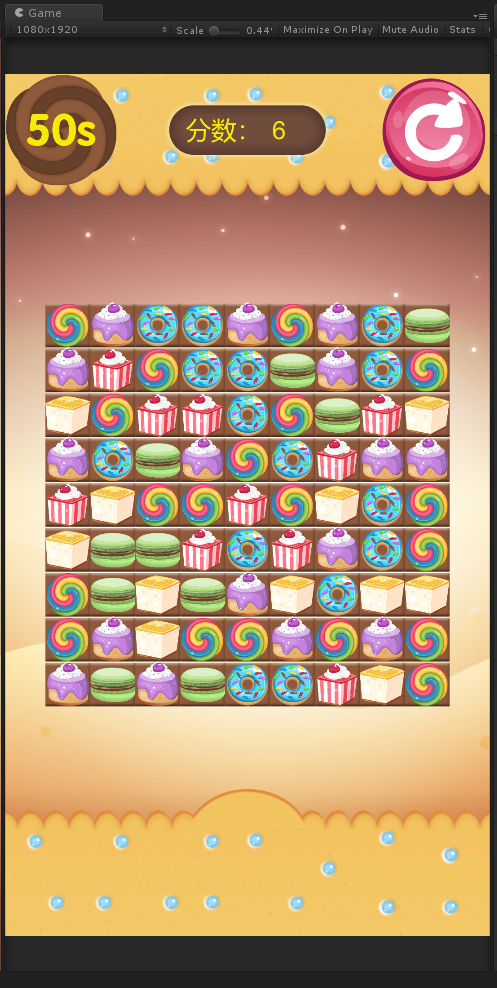

# 基于LuaFrameWork框架实现的三消游戏
1. 效果图
   

2. 代码：
   框架采用LuaFrameWork框架
   游戏逻辑基本上使用lua侧实现
   Unity2018.2开发

3. 实现功能如下：
   随机生成地图
   消除行或者列的同色元素
   下落填充空位
   生成新元素补充空位
   倒计时
   死图判定
   2D相机适配
   UI相机适配
   。。。

4. 剩余补充
   音乐和音效
   lua侧协程bug，不能停止协程
